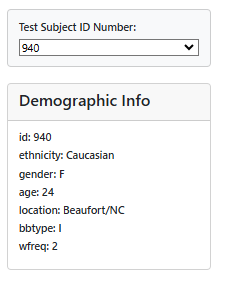
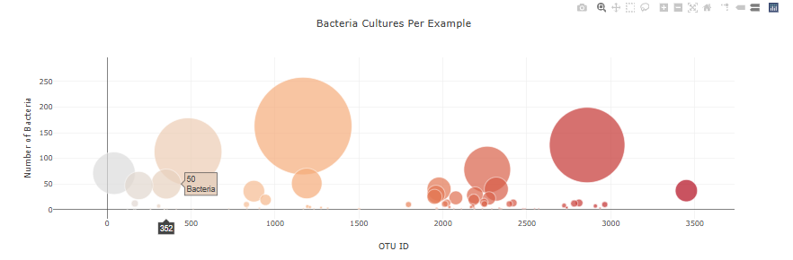
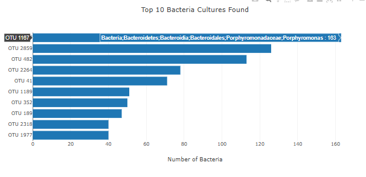

# javascript-visualization-challenge
Data Analytics Course Module 14

# Task
Using a Belly Button Biodviersity dataset (which catalogs the microbes that colonize human navels), I will build an interactive dashboard. 

# Methodology
Using starter index.html as well as a an app.js file, I will use JavaScripta and the D3 library to edit the HTML site and D3.json to fetch data.

I will first build a function that displays a panel of demographic data for each subject ID. It updates when users select different subject Ids. 

Next, I will develop a function that builds a bubble chart and a bar chart for any subject, with hovertext that displays specific bacteria labels as hovertext.

The third function will initialize the page loading and building charts with the first sample in the list of subject IDs. 
The final function is an event listener to build new charts when a new subject ID is selected.

## Results

The dashboard is available here: [Bellybutton Biodiversity](https://hmk81996.github.io/javascript-visualization-challenge/).

The data confirms the statement from the background section of the Module 14 assignment: "The dataset reveals that a small handful of microbial species...or OTUs...were present in more thant 70% of people, while the rest were relatively rare.
Another extension of this project could be to create charts showing the frequency of each bacteria type.
